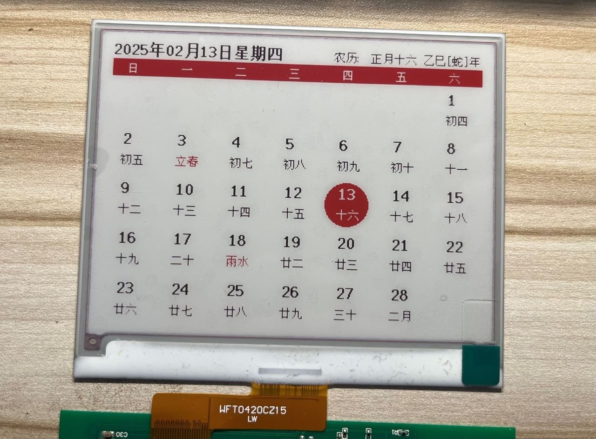

# EPD-nRF51

4.2 寸电子墨水屏固件，带有一个[网页版上位机](https://tsl0922.github.io/EPD-nRF51/)，可以通过蓝牙传输图像到墨水屏，也可以把墨水屏设置为日历模式（支持农历、节气）。

理论上支持所有 nRF51 系列 MCU，支持 UC8176 驱动的 4.2 寸黑白/黑白红墨水屏（可切换驱动），同时还支持自定义墨水屏到 MCU 的引脚映射，支持睡眠唤醒（NFC / 无线充电器）。



## 支持设备

- 老五 4.2 寸价签，黑白双色版本

	```
	MCU：nRF51822
	RAM：16K
	ROM：128K

	驱动：UC8176 (EPD_4in2)
	屏幕引脚：0508090A0B0C0D
	线圈引脚：07
	```

	

- 老五 4.2 寸价签，黑白红三色版本

	```
	MCU：nRF51802
	RAM：16K
	ROM：256K

	驱动：UC8176 (EPD_4in2b_V2)
	屏幕引脚：0A0B0C0D0E0F10
	线圈引脚：09
	LED引脚：03/04/05 （有三个 LED，任选一个使用）
	```

	

## 上位机

本项目自带一个基于浏览器蓝牙接口实现的网页版上位机，可通过上面网址访问，或者在本地直接双击打开 `html/index.html` 来使用。

- 地址：https://tsl0922.github.io/EPD-nRF51
- 演示：https://www.bilibili.com/video/BV1KWAVe1EKs
- 交流群: [1033086563](https://qm.qq.com/q/WEBAZgyyc2) (点击链接加入群聊)


## 开发

> **注意:**
> - 必须使用 [Keil 5.36](https://img.anfulai.cn/bbs/96992/MDK536.EXE) 或以下版本，nRF51 SDK 只支持 V5 版本的 ARM 编译器，从 5.37 版本开始 Keil 已经不再内置 V5 版本编译器
> - `sdk10` 分支为旧版 SDK 代码，蓝牙协议栈占用的空间小一些，用于支持 128K Flash 芯片

项目配置有几个 `Target`：

- `nRF51802_xxAA`: 用于编译 256K Flash 固件
- `flash_softdevice`: 刷蓝牙协议栈用（只需刷一次）

烧录器可以使用 J-Link 或者 DAPLink（可使用 [RTTView](https://github.com/XIVN1987/RTTView) 查看 RTT 日志）。

**刷机流程:**

> 如不修改代码，建议到 [Releases](https://github.com/tsl0922/EPD-nRF51/releases) 下载二进制固件，开箱即用。

1. 全部擦除 (Keil 擦除后刷不了的话，使用烧录器的上位机软件擦除试试)
2. 切换到 `flash_softdevice`，**不要编译直接下载**（只需刷一次）
3. 切换到 `nRF51802_xxAA`，先编译再下载

## 致谢

- 屏幕驱动代码来自微雪 [E-Paper Shield](https://www.waveshare.net/wiki/E-Paper_Shield)
- 网页版上位机代码来自 [atc1441/ATC_TLSR_Paper](https://github.com/atc1441/ATC_TLSR_Paper)
