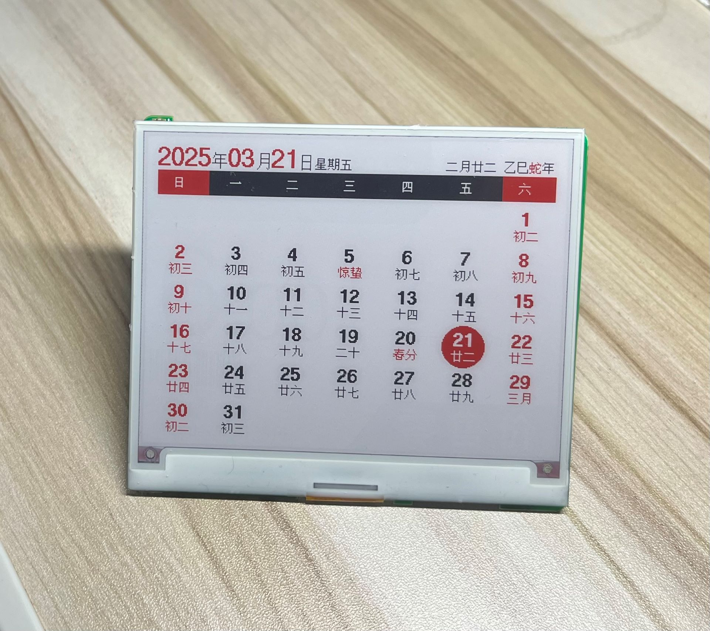
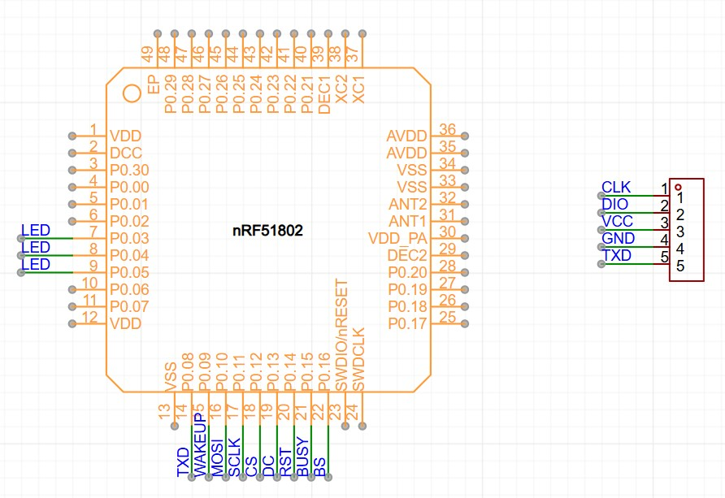
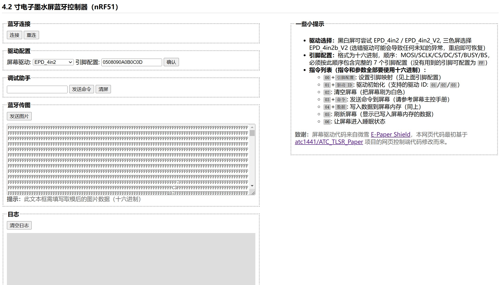

# EPD-nRF5

4.2 寸电子墨水屏固件，带有一个[网页版上位机](https://tsl0922.github.io/EPD-nRF5/)，可以通过蓝牙传输图像到墨水屏，也可以把墨水屏设置为日历模式（支持农历、节气）。

支持 `nrf51822` / `nrf51802` / `nrf52811` / `nrf52810` MCU 作为主控，驱动 IC 为 `UC8176` / `UC8276` / `SSD1619` / `SSD1683` 的 4.2 寸黑白/黑白红墨水屏，同时还支持自定义墨水屏到 MCU 的引脚映射，支持睡眠唤醒（NFC / 无线充电器）。



## 支持设备

- 老五 4.2 寸价签，黑白双色版本

    ```
    MCU：nrf51822
    RAM：16K
    ROM：128K

    驱动：UC8176 (EPD_4in2)
    屏幕引脚：0508090A0B0C0D
    线圈引脚：07
    ```

    

- 老五 4.2 寸价签，黑白红三色版本

    ```
    MCU：nrf51802
    RAM：16K
    ROM：256K

    驱动：UC8176 (EPD_4in2b_V2)
    屏幕引脚：0A0B0C0D0E0F10
    线圈引脚：09
    LED引脚：03/04/05 （有三个 LED，任选一个使用）
    ```

    

- 其它基于 `nrf51822` / `nrf51802` / `nrf52811` / `nrf52810` 的价签，理论上都支持

## 上位机

本项目自带一个基于浏览器蓝牙接口实现的网页版上位机，可通过上面网址访问，或者在本地直接双击打开 `html/index.html` 来使用。

- 地址：https://tsl0922.github.io/EPD-nRF5
- 演示：https://www.bilibili.com/video/BV1KWAVe1EKs
- 交流群: [1033086563](https://qm.qq.com/q/SckzhfDxuu) (点击链接加入群聊)



> **提示:** 上图展示的部分不常用的功能现已默认隐藏，如需显示可点击页面底部的 `开发模式` 链接。

## 致谢

本项目使用或参考了以下项目的代码：

- [ZinggJM/GxEPD2](https://github.com/ZinggJM/GxEPD2)
- [waveshareteam/e-Paper](https://github.com/waveshareteam/e-Paper)
- [atc1441/ATC_TLSR_Paper](https://github.com/atc1441/ATC_TLSR_Paper)
