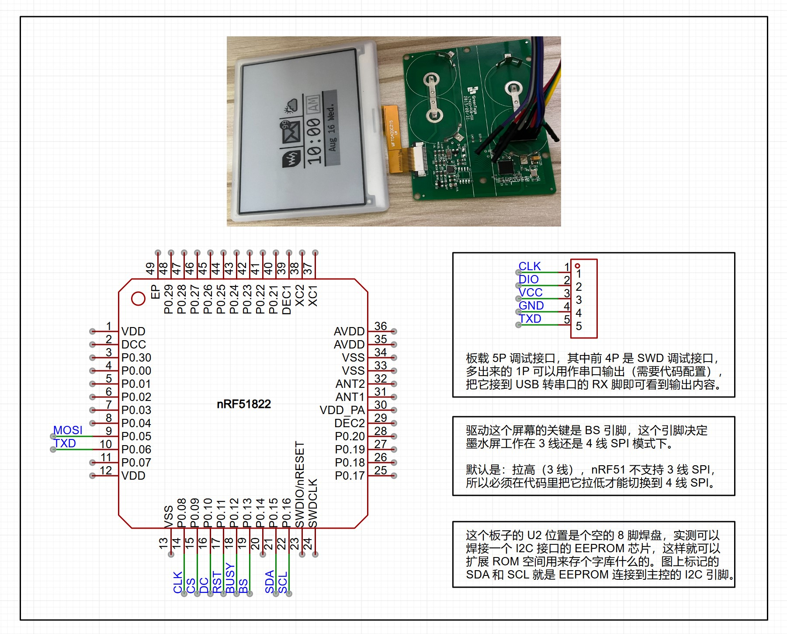
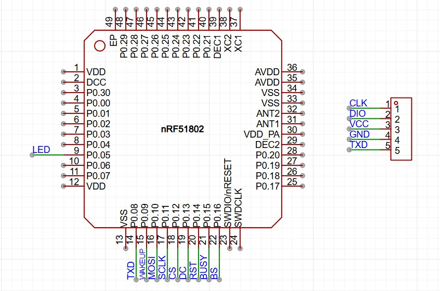

# EPD-nRF51

4.2 寸电子墨水屏固件，带有一个[网页版上位机](https://tsl0922.github.io/EPD-nRF51/)，可以通过蓝牙传输图像到墨水屏。

理论上支持所有 nRF51 系列 MCU，内置 3 个微雪 4.2 寸墨水屏驱动（可切换），同时还支持自定义墨水屏到 MCU 的引脚映射，支持睡眠唤醒（NFC / 无线充电器）。

## 支持设备

- 老五 4.2 寸价签，黑白双色版本

	```
	MCU：nRF51822
	RAM：16K
	ROM：128K

	驱动：EPD_4in2
	屏幕引脚：0508090A0B0C0D
	线圈引脚：07
	```

	

- 老五 4.2 寸价签，黑白红三色版本

	```
	MCU：nRF51802
	RAM：16K
	ROM：256K

	驱动：EPD_4in2b_V2
	屏幕引脚：0A0B0C0D0E0F10
	线圈引脚：09
	LED引脚：03/04/05 （有三个 LED，任选一个使用）
	```

	

默认驱动和引脚映射为黑白双色版本，其它版本需要切换驱动并修改引脚映射。

## 上位机

地址：https://tsl0922.github.io/EPD-nRF51/ 


本项目自带一个基于浏览器蓝牙接口实现的网页版上位机，可通过上面网址访问，或者在本地直接双击打开 `html/index.html` 来使用。

至于能不能使用，要看你打开这个页面的设备是否带有蓝牙硬件，还有使用的浏览器是否支持蓝牙接口。

## 开发

> **注意:**
> - 必须使用 [Keil 5.36](https://img.anfulai.cn/bbs/96992/MDK536.EXE) 或以下版本，nRF51 SDK 只支持 V5 版本的 ARM 编译器，从 5.37 版本开始 Keil 已经不再内置 V5 版本编译器。
> - 默认的 `IRAM`/`IROM` 配置是 `16K`/`128K` 版本芯片的，其它容量的芯片需要做相应修改，如果你用得到那么多容量的话。

项目配置有 3 个 `Target`：

- `EPD`: 用于编译正式版固件
- `EPD-Debug`: 开发用，开启了日志和 RTT
- `flash_softdevice`: 刷蓝牙协议栈用

**刷机流程:**

先擦除，再切换到 `flash_softdevice` 刷蓝牙协议栈（不要编译直接下载，只需刷一次），最后切换到 `EPD` 编译后再下载。

## 致谢

- 屏幕驱动代码来自微雪 [E-Paper Shield](https://www.waveshare.net/wiki/E-Paper_Shield)
- 网页版上位机代码来自 [atc1441/ATC_TLSR_Paper](https://github.com/atc1441/ATC_TLSR_Paper)
