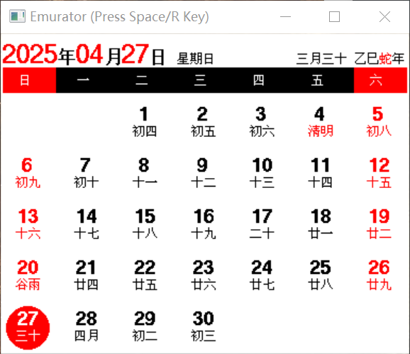

## 开发

> **注意:**
> - 推荐使用 [Keil 5.36](https://img.anfulai.cn/bbs/96992/MDK536.EXE) 或以下版本（如遇到 pack 无法下载，可到群文件下载）
> - `sdk10` 分支为旧版 SDK 代码，蓝牙协议栈占用的空间小一些，用于支持 128K Flash 芯片（不再更新）

这里以 nRF51 版本项目为例 (`Keil/EPD-nRF51.uvprojx`)，项目配置有几个 `Target`：

- `nRF51822_xxAA`: 用于编译 256K Flash 固件
- `flash_softdevice`: 刷蓝牙协议栈用（只需刷一次）

烧录器可以使用 J-Link 或者 DAPLink（可使用 [RTTView](https://github.com/XIVN1987/RTTView) 查看 RTT 日志）。

**刷机流程:**

> **注意:** 这是自己编译代码的刷机流程。如不改代码，强烈建议到 [Releases](https://github.com/tsl0922/EPD-nRF5/releases) 下载编译好的固件，**不需要单独下载蓝牙协议栈**，且有 [刷机教程](https://b23.tv/AaphIZp) （没有 Keil 开发经验的，请不要给自己找麻烦去编译）

1. 全部擦除 (Keil 擦除后刷不了的话，使用烧录器的上位机软件擦除试试)
2. 切换到 `flash_softdevice`，下载蓝牙协议栈，**不要编译直接下载**（只需刷一次）
3. 切换到 `nRF51822_xxAA`，先编译再下载

### 模拟器

本项目提供了一个可在 Windows 下运行界面代码的模拟器，修改了界面代码后无需下载到单片机即可查看效果。

仿真效果图：



> **提示:** 按`R`键切换黑白、三色，空格键切换日历时钟界面，上下键切换月份，左右键切换日期。

**编译方法：**

下载并安装 [MSYS2](https://www.msys2.org) 后，打开 `MSYS2 MINGW64` 命令窗口执行：

```bash
pacman -Syu
pacman -S make mingw-w64-x86_64-gcc
cd <本项目目录>
make -f Makefile.win32
```

## 附录

上位机支持的指令列表（指令和参数全部要使用十六进制）：

- 驱动相关：
    - `00`+`引脚配置`: 设置引脚映射（见上面引脚配置）
    - `01`+`驱动ID`: 驱动初始化
    - `02`: 清空屏幕（把屏幕刷为白色）
    - `03`+`命令`: 发送命令到屏幕（请参考屏幕主控手册）
    - `04`+`数据`: 写入数据到屏幕内存（同上）
    - `05`: 刷新屏幕（显示已写入屏幕内存的数据）
    - `06`: 屏幕睡眠
- 日历模式：
    - `20`+`UNIX时间戳`+`时区`: 同步时间并开启日历模式
- 系统相关：
    - `90`+`配置数据`: 写入自定义配置（重启生效）
    - `91`: 系统重启
    - `92`: 系统睡眠
    - `99`: 恢复默认设置并重启
